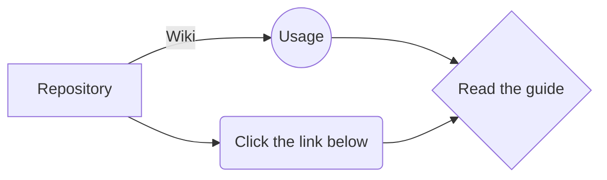

# Embed Storage
Embed Storage is a place where data files of Discord Embeds are saved and can be used at any time. The data files are 	``json`` files. 

# Frequently Asked Questions
In this category, you can see what are some questions that are asked frequently. For example, what it is used for etc. Which is suggested for you to read. 

## What servers are the embeds for?
Now, you are probably wondering, for who and what servers are these embeds for and the answer is down below. 

- The servers that are the embeds for are currently:
	> DexScript 

*More will be added in the future.*

## What is it used for?
Well, this is used for the servers mentioned above, for certain individuals, and there may be certain files that you will need permission to use, these files will have a text file in their respective folders. 

## Can I use it?
If you are wondering if you could use it please read the [license file](https://github.com/Reictangle/EmbedStorage/blob/main/LICENSE). Read it slowly and carefully. 

## How do I use it?

Well, for this question we have this chart showing you how to go to the wiki of this repository.

And if you were wondering what link it is talked about, [this link](https://github.com/Reictangle/EmbedStorage/wiki).

